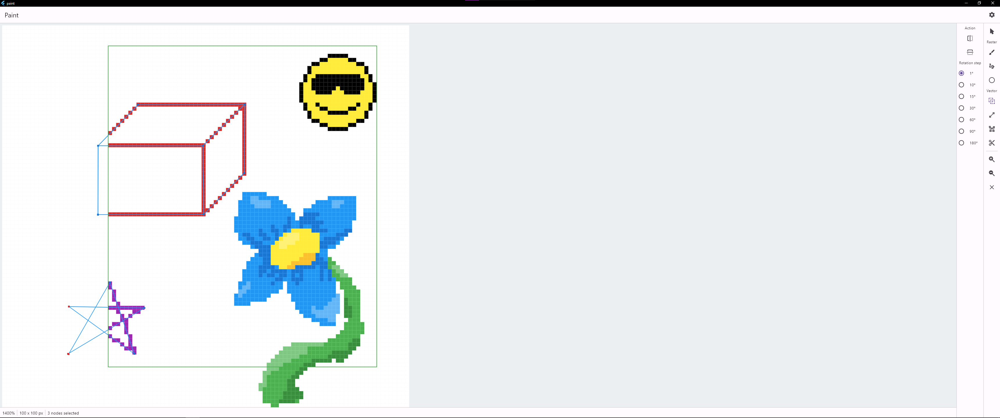
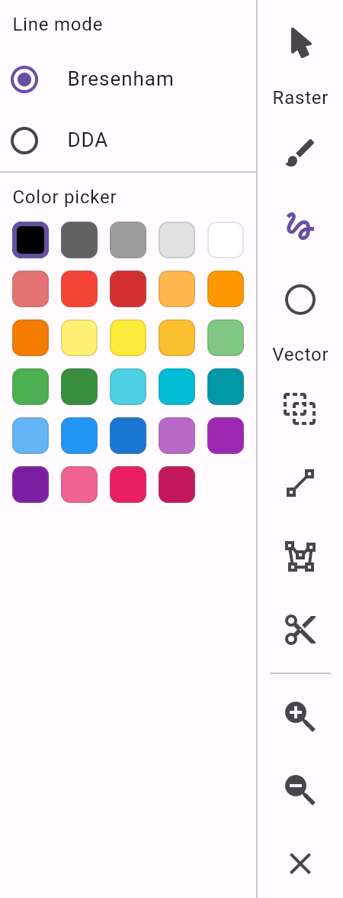
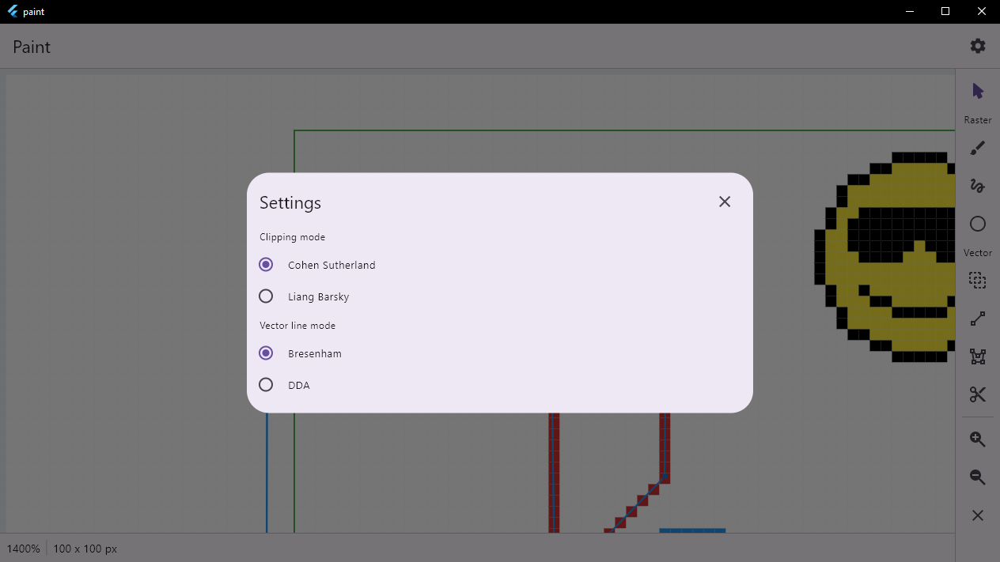

# paint

A simple drawing application, made using [Flutter](https://flutter.dev/).

### About

###### Features

Circle rasterization mode:
* Bresenham.

Line rasterization modes:
* Bresenham; 
* DDA.

Line clipping modes:
* Cohen Sutherland; 
* Liang Barsky.

Vector node operations:
* Flipping; 
* Rotation (Select vector, Scroll Wheel); 
* Scaling (Select vector, Shift + LMB drag); 
* Translation (Select vector, LMB drag).

Other features:
* Clear canvas (Delete); 
* Select all nodes for vector selection tool (Ctrl + A); 
* Zooming (Ctrl + +, Ctrl + -, Ctrl + 0); 

###### Toolbar

Raster tools:
* Circle tool (R); 
* Free hand brush (B); 
* Line tool (L). 

Vector tools:
* Clipping tool (Ctrl + W); 
* Line tool (Ctrl + L); 
* Vector selection (Ctrl + Q); 
* Polygon tool (Ctrl + P).

### Folder structure

* `lib/` : Dart source code.
* `lib/controllers` : Efficient data manipulation and propagation.
* `lib/core` : Core functionality - drawers, clippers.
* `lib/model` : Internal data structure definitions.
* `lib/pages` : App pages.
* `lib/painters` : Data views that reflect controller data and updates and overlays.
* `lib/widgets` : Reusable and modular ui components and core ui elements.

### Installation

 `flutter pub get`

### Running

##### Web

 `flutter run web`

##### Windows

 `flutter run windows`

### Notes

* Includes a [Caprover](https://caprover.com/) definition file to enable simple web hosting, using [Nginx](https://www.nginx.com/) and [Docker](https://www.docker.com/). Currently deployed [here](https://paint.suresure.me/).
